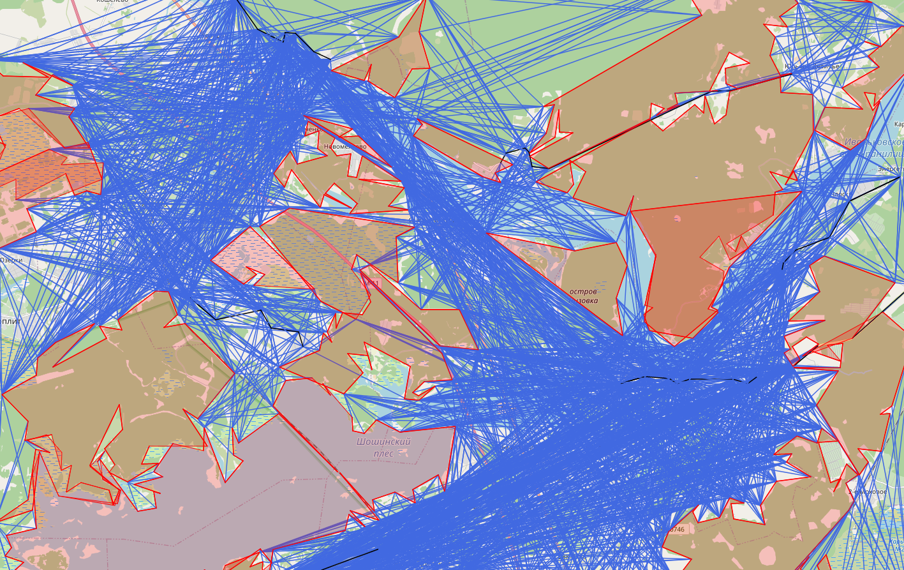

# Off-road navigation system
[__Documentation__](https://github.com/Denikozub/Offroad-routing-engine#documentation)  
[__Usage__](https://github.com/Denikozub/Offroad-routing-engine#usage)  
[__Graph visualization__](https://denikozub.github.io/Offroad-routing-engine/)
___
by Denis Kozub
- World discretization using _visibility graphs_
- O(nh log n) _reduced_ visibility graph algorithm (see [algorithm explanation](https://github.com/Denikozub/Offroad-routing-engine/blob/main/docs/algorithm.pdf))
- Pathfinding _without_ graph precomputing
- _Hierarchical approach_ for graph building
- No projected crs, works in any part of the world
- Open source OpenStreetMap data (see [OSM data explanation](https://github.com/Denikozub/Offroad-routing-engine/blob/main/docs/OSM_data.ipynb))
- Ability to download OMS maps at runtime
- Ability to save and load precomputed map data
- Visualization tools support



Scope of application:
- Extending functionality of other routing engines  
- Road building  
- Rescue and military operations planning  
- Route planning for hiking and tourism  


# Documentation
VisibilityGraph is a class for building a visibility graph on a given area from OSM data  

~~~python
compute_geometry(bbox, filename=None)
~~~
Parse OSM file (area in bounding box) to retrieve information about roads and surface.  
This method uses [pyrosm](https://pypi.org/project/pyrosm/), which requires [geopandas](https://geopandas.org/) to be installed.  
What is more, curl and [osmosis](https://wiki.openstreetmap.org/wiki/Osmosis) are required for downloading the map.  
__bbox__: sequence in format min_lon, min_lat, max_lon, max_lat  
__filename__: None (map will be downloaded) or str in .osm.pbf format  
__return__ None  

~~~python
build_dataframe(epsilon_polygon=None, epsilon_linestring=None, bbox_comp=15, remove_inner=False)
~~~
Transform retrieved data:
* transform geometry to tuple of points
* run Ramer-Douglas-Peucker to geometry objects
* get rid of small objects with bbox_comp parameter
* add data about convex hull for polygons  

Default parameters will be computed for the given area to provide best performance.  
__epsilon_polygon__: None or Ramer-Douglas-Peucker algorithm parameter for polygons  
__epsilon_linestring__: None or Ramer-Douglas-Peucker algorithm parameter for linestrings  
__bbox_comp__: None or int - scale polygon comparison parameter (to size of map bbox)  
__remove_inner__: bool - inner polygons for other polygons should be removed (True) or not (False)  
(currently their share of all polygon is too low due to lack of OSM data and pyrosm problems)  
__return__ None  

~~~python
save_geometry(filename)
~~~
Save computed data to .h5 file  

~~~python
load_geometry(filename)
~~~
Load saved data from .h5 file  

~~~python
incident_vertices(point_data, inside_percent=0.4)
~~~
Finds all incident vertices in visibility graph for given point.  
__point_data__: _point_data_ of given point  
__inside_percent__: float - probability of an inner edge to be added (from 0 to 1)  
__return__ list of point_data of all visible points  
_point_data_ is a tuple where:  
* 0 element: tuple of x, y - point coordinates
* 1 element: int - number of object where point belongs
* 2 element: int - number of point in object
* 3 element: bool - object is polygon (True) or linestring (False)
* 4 element: int - surface type (0 - edge between objects, 1 - edge inside polygon, 2 - road edge)


~~~python
build_graph(inside_percent=1, graph=False, map_plot=None, crs='EPSG:4326')
~~~
Compute [and build] [and plot] visibility graph  
__inside_percent__: float - probability of an inner edge to be added (from 0 to 1)  
__graph__: bool - build (True) or not to build (False) a networkx graph  
__map_plot__: None or tuple of colors to plot visibility graph
* 0 element: color to plot polygons  
* 1 element: dict of colors to plot edges  
    * 0: edges between objects
    * 1: edges inside polygon
    * 2: road edges  

__crs__: string parameter: coordinate reference system  
__return__ None

# Usage
[ipynb notebook](https://github.com/Denikozub/Offroad-routing-engine/blob/main/docs/example.ipynb)

### Downloading and processing data

There are two ways you can obtain OSM data in osm.pbf format:  
- Download it yourself: [parts of the world](https://download.geofabrik.de/), [cities](https://download.bbbike.org/osm/bbbike/), [adjustable area](https://extract.bbbike.org/) (via mail), [adjustable area](https://export.hotosm.org/en/v3/) (online), [planet](https://planet.maps.mail.ru/pbf/)
- Let the program download it for you

If the map is downloaded you can specify the filename:


```python
from visibility_graph import VisibilityGraph

map_data = VisibilityGraph()
filename = "../maps/kozlovo.osm.pbf"
bbox = [36.2, 56.5, 36.7, 57]
map_data.compute_geometry(bbox=bbox, filename=filename)
```

Or, alternatively, you can only specify the bounding box, and the map will be downloaded automatically ([curl](https://curl.se/) & [osmosis](https://wiki.openstreetmap.org/wiki/Osmosis) required):


```python
bbox = [34, 59, 34.2, 59.1]
map_data.compute_geometry(bbox=bbox)
```

Data inside this area can be processed using VisibilityGraph with chosen or default parameters.  
If not specified, optimal parameters will be computed by the algorithm.


```python
map_data.build_dataframe(epsilon_polygon=0.003,
                         epsilon_linestring=0.001,
                         bbox_comp=10)
```

Computed data can also be saved in .h5 file to skip data processing the next time:


```python
map_data.save_geometry("../maps/user_area.h5")
```

### Using precomputed data and building visibility graph


```python
from visibility_graph import VisibilityGraph

map_data = VisibilityGraph()
map_data.load_geometry("../maps/kozlovo.h5")
```

Visibility graph can be built and (optionally) saved as networkx graph and (optionally) visualised using [mplleaflet](https://pypi.org/project/mplleaflet/):


```python
%%time
import mplleaflet

map_plot=('r', {0: "royalblue", 1: "r", 2: "k"})
G, fig = map_data.build_graph(inside_percent=0,
                              graph=True,
                              map_plot=map_plot)

print('edges: ', G.number_of_edges())
print('nodes: ', G.number_of_nodes())
mplleaflet.display(fig=fig)
```

Check out the [result](https://denikozub.github.io/Offroad-routing-engine/) provided by mplleaflet!  
Computational time for an extremely dense area of 800 km<sup>2</sup> is about 2 minutes 30 seconds.  
Computational time for a much freer area or 120 km<sup>2</sup> (see [another example](https://github.com/Denikozub/Offroad-routing-engine/tree/main/docs/another%20example)) is just above 9 seconds!

VisibilityGraph may also be used to find incident edges for a single point.  
This feature is used for pathfinding without graph building:


```python
import matplotlib.pyplot as plt
import mplleaflet

start = ([36.35, 56.57], None, None, None, None)
incidents = map_data.incident_vertices(start)

fig = plt.figure()
plt.scatter(start[0][0], start[0][1], color='r')
for p in incidents:
    plt.scatter(p[0][0], p[0][1], color='b')
mplleaflet.display(fig=fig)
```
