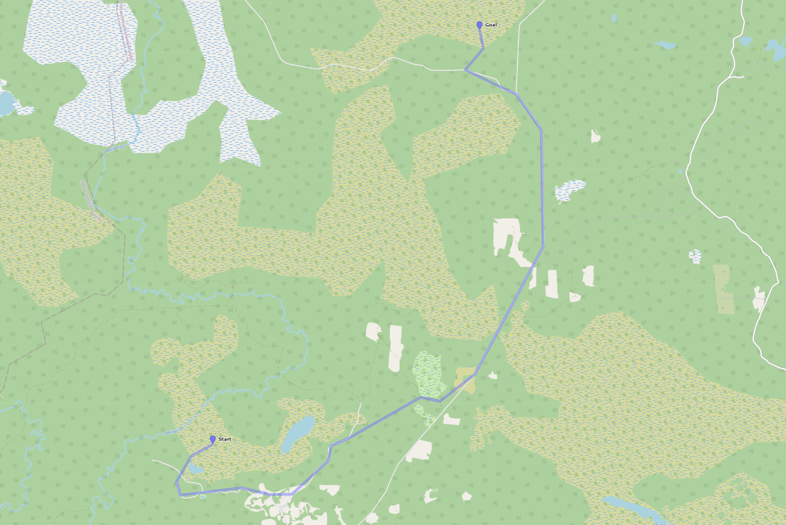

# Off-road Navigation & Analysis System
[__Installation__](https://denikozub.github.io/Offroad-routing-engine/#installation)  
[__Documentation__](https://denikozub.github.io/Offroad-routing-engine/#documentation)  
[__Usage__](https://denikozub.github.io/Offroad-routing-engine/#usage)  
___
by Denis Kozub
- World discretization using visibility graphs
- O(nh log nh) reduced visibility graph algorithm (see [algorithm explanation](https://github.com/Denikozub/Offroad-routing-engine/blob/main/docs/algorithm.pdf))
- A* pathfinding with & without graph precomputing
- Road network and natural objects simplification algorithms
- Open source OpenStreetMap data (see [OSM data explanation](https://github.com/Denikozub/Offroad-routing-engine/blob/main/docs/OSM_data.ipynb))
- Geometry module for map data parsing, processing and saving
- Multiprocessing and visualization tools

Scope of application:
- Extending functionality of other routing engines
- Road and facilities design
- Rescue operations planning
- Route planning for hiking and tourism
