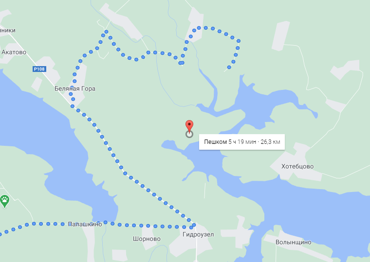

# Off-road navigation system
- O(h log n) on-line _reduced visibility graph_ algorithm
- A* pathfinding _without_ graph precomputing
- Dynamic edge weights
- Huge database of hiking and country roads
- Super fast pathfinding on large areas
- _Hierarchical approach_ for graph building
- OSM maps data
- No projected crs -> more accuracy and speed
- Minimized stored and precomputed data

This is how Google routing engine (and all others) currently [01.02.2021] work. I am ready to change this.

Scope of application:
- Extending functionality of other routing engines  
- Road building  
- Rescue and military operations planning  
- Route planning for hiking and tourism  
