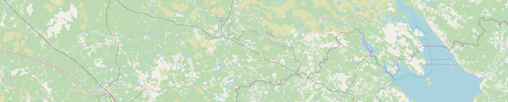

Offroad Routing Engine
**********************

This module is made for downloading and parsing OSM maps, pathfinding and visibility graph building using hierarchical approach, saving and visualizing results.
Main goal was to fully optimize geometry algorithms and achieve lowest computational time possible. Low-level data transfer approach has been used and
a unique algorithm, created specifically for off-road routing, has been implemented. See `algorithm explanation <https://github.com/Denikozub/Offroad-routing-engine/blob/main/docs/algorithm.pdf>`_.

Installation
============

Install from repository::

	pip install -e "git+https://github.com/Denikozub/Offroad-routing-engine.git#egg=offroad_routing"

It is recommended to install packages using conda. Pip warning: package requires GeoPandas to be installed, which can be problematic on Windows. `This <https://towardsdatascience.com/geopandas-installation-the-easy-way-for-windows-31a666b3610f/>`_ article may help.

Usage
=====

You can follow by running the code in `IPython notebook <https://github.com/Denikozub/Offroad-routing-engine/blob/main/docs/usage.ipynb>`_.

Processing and pruning data
+++++++++++++++++++++++++++

There are two ways you can obtain OSM data in osm.pbf format:

- Download it yourself: `parts of the world <https://download.geofabrik.de/>`_, `cities <https://download.bbbike.org/osm/bbbike/>`_, `adjustable area <https://extract.bbbike.org/>`_ (via mail), `adjustable area <https://export.hotosm.org/en/v3/>`_ (online), `planet <https://planet.maps.mail.ru/pbf/>`_
- Let the program download it for you

If the map is downloaded, you can specify the filename and parse it::

	from offroad_routing import VisibilityGraph

	vgraph = VisibilityGraph()
	filename = "../maps/kozlovo.osm.pbf"
	bbox = [36.2, 56.5, 36.7, 56.7]
	vgraph.compute_geometry(bbox=bbox, filename=filename)

Or, alternatively, you can only specify the bounding box, and the map will be downloaded automatically (`curl <https://curl.se/>`_ & `osmosis <https://wiki.openstreetmap.org/wiki/Osmosis>`_ required)::

	bbox = [34, 59, 34.2, 59.1]
	vgraph.compute_geometry(bbox=bbox)

Parsed data can be pruned with chosen or default parameters.  
If not specified, optimal parameters will be computed by the algorithm::

	vgraph.prune_geometry(epsilon_polygon=0.003,
		 	      epsilon_polyline=0.001,
			      bbox_comp=10)

Computed data can also be saved in .h5 file to skip data processing the next time::

	vgraph.save_geometry("../maps/user_area.h5")

Building visibility graph
+++++++++++++++++++++++++

Loading precomputed data::

	from offroad_routing import VisibilityGraph
	
	vgraph = VisibilityGraph()
	vgraph.load_geometry("../maps/user_area.h5")

Visibility graph can be built and visualized using osmnx::

	import osmnx as ox

	G = vgraph.build_graph(inside_percent=0, multiprocessing=False)
	ox.plot_graph(G)

VisibilityGraph may also be used to find incident edges for a single point.  
This feature is used for pathfinding without graph building::

	import matplotlib.pyplot as plt
	import mplleaflet

	start = ((34.02, 59.01), None, None, None, None)
	incidents = vgraph.incident_vertices(start)

	fig = plt.figure()
	plt.scatter(start[0][0], start[0][1], color='r')
	for p in incidents:
		plt.scatter(p[0][0], p[0][1], color='b')
	mplleaflet.display(fig=fig)

Pathfinding and visualization
+++++++++++++++++++++++++++++

Astar algorithm can be used to find paths between points on the map::

	from offroad_routing import VisibilityGraph, AStar

	vgraph = VisibilityGraph()
	vgraph.load_geometry("../maps/user_area.h5")

	pathfinder = AStar(vgraph)
	path = pathfinder.find((34.02, 59.01), (34.12, 59.09), default_weight=10, heuristic_multiplier=10)

Path can be viewed in coordinate format::

	print(path.path())

However, specialized tools can be used to save and visualize the path.
The following code saves the path to a gpx file and generates a link to view it online::

	from offroad_routing import GpxTrack

	track = GpxTrack(path)
	track.write_file("track.gpx")
	track.visualize()

You can check the route `here <https://nakarte.me/#nktj=W3sibiI6ICIyMDIxLTA5LTE5IiwgInAiOiBbeyJuIjogIlN0YXJ0IiwgImx0IjogNTkuMDEsICJsbiI6IDM0LjAyfSwgeyJuIjogIkdvYWwiLCAibHQiOiA1OS4wOSwgImxuIjogMzQuMTJ9XSwgInQiOiBbW1s1OS4wMSwgMzQuMDJdLCBbNTkuMDA3NzI1NSwgMzQuMDEyMDA2M10sIFs1OS4wMDI3NDk4LCAzNC4wMDY1MTM5XSwgWzU5LjAwMDE5NSwgMzQuMDA4MDM1N10sIFs1OS4wMDE1NTg5LCAzNC4wMzA4NDMyXSwgWzU5LjAwMDI3ODcsIDM0LjA0MTcxOV0sIFs1OS4wMDAzNzc2LCAzNC4wNDk3MTU2XSwgWzU5LjAwNjc2NDEsIDM0LjA2MzMzNjFdLCBbNTkuMDA5NzI2MywgMzQuMDY0NTAxMl0sIFs1OS4wMTExMDE4LCAzNC4wNzA5MjAzXSwgWzU5LjAxOTExNjcsIDM0LjA5Nzk1NzZdLCBbNTkuMDE4MjgyOCwgMzQuMTA1MTg4OF0sIFs1OS4wMjM0ODk5LCAzNC4xMTgxNjY5XSwgWzU5LjA0ODE3MDMsIDM0LjE0Mzg1NjldLCBbNTkuMDcwNjk4NSwgMzQuMTQzMDg0NF0sIFs1OS4wNzc1NDY3LCAzNC4xMzM4NzkxXSwgWzU5LjA4MjI2OTEsIDM0LjExNDU5MjRdLCBbNTkuMDg2NDQxNiwgMzQuMTIxNDY4M10sIFs1OS4wOSwgMzQuMTJdXV19XQ==>`_.

Documentation
=============

VisibilityGraph
+++++++++++++++

.. autoclass:: offroad_routing.VisibilityGraph

	.. automethod:: offroad_routing.VisibilityGraph.compute_geometry
	.. automethod:: offroad_routing.VisibilityGraph.prune_geometry
	.. automethod:: offroad_routing.VisibilityGraph.save_geometry
	.. automethod:: offroad_routing.VisibilityGraph.load_geometry
	.. automethod:: offroad_routing.VisibilityGraph.incident_vertices
	
	`PointData Explanation`_
	
	.. automethod:: offroad_routing.VisibilityGraph.build_graph

AStar
+++++

.. autoclass:: offroad_routing.AStar
	:members:
	:special-members: __init__

GpxTrack
++++++++

.. autoclass:: offroad_routing.GpxTrack
	:members:
	:special-members: __init__

PointData Explanation
+++++++++++++++++++++

In order to speed up computation, low-level data transfer approach is used.  
Data about points, polylines and polygons is transferred using tuples instead of structures.

.. autodata:: offroad_routing.visibility.visibility_graph.TPoint
.. autodata:: offroad_routing.visibility.visibility_graph.PointData

.. toctree::
   :maxdepth: 2
   :caption: Contents:

Indices and tables
==================

* :ref:`genindex`
* :ref:`modindex`
* :ref:`search`
